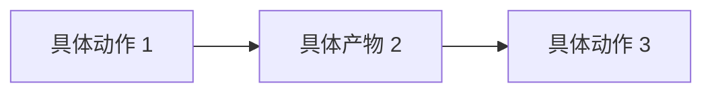

<!--
本模板从 27 份高质量人物档案的实践里提炼，融合 synaptiai evidence-ledger、
Wikipedia BLP / Notability 规范、Anthropic skill 目录标准、Karpathy 两阶段 pipeline。

【结构 · 11 条硬规矩】
1. 一级章节固定 11 个，名称与顺序不可增删改。缺项就写明「本次未取得」，不要删章节。
2. 关系网络必须双向。A 链 B，则 B 的档案里必须有一条链回 A。

【标点 · 禁止项】
3. 禁用破折号 ——、—、–。行文里改用句号或逗号；年份区间用半角连字符（2005-2017）。
   作品名、书名、人物原话内部的连接号属于原文，保留不改。
4. 提示性冒号只允许引出人物直接原话。「核心是：」一律改句号。
   但允许用于：机器字段、URL、参考资料字段分隔。
5. 禁翻案腔「不是 A 而是 B」。需要划边界时写成「A 是主要来源，B 排在后面」。
6. 禁商业黑话：闭环、能力沉淀、赋能、抓手、底层逻辑、内容矩阵、拉通、复利、范本、范式。
7. 禁模型路标词：值得注意的是、本质上、由此可见、从某种意义上说、总之、总体而言。
8. 禁借喻清单：仓库、抽屉、温度、坍塌、浪潮、钥匙、底座。

【事实 · 证据纪律】
9. 每条事实必须可点开核验。链接要用本次实际抓取到的地址；抓不到就写「未取得」，绝不凭记忆构造 URL。
10. 查不到的东西标「待核实」，并在同一句写清为什么查不到。不得为减少「待核实」计数而删限定语或编造来源。
11. 证据身份分级（写进可信度章节）：①可靠事实 ②机构自述 ③旁人回忆 ④作者推断 ⑤未知。
    机构自述不能当事实用；来源冲突时两说并列，不挑最适合故事的那条写死。
12. 引语改写规则：引号内一个字都不能动。要消除引语里的破折号，就把引语在破折号处断成两段，
    破折号落到引号之外换成「他先说」「理由是」这类叙述性连接。

【判断 · 必须可反驳】
13. 核心价值观里至少挑一条最强判断，写成具体、可被反驳的立场，不要写描述。
14. 判断写完必须做反例审查：主动找一条能反驳它的作品或事实，
    段末用一行斜体写明处理方式（吸收 / 驳倒 / 确认破例并标明），并划清适用边界。
    找不到真反例就不要硬造，改成写清适用边界。
    反例只能取自本档案已有的材料，不许联网现找来凑。
15. 注意区分：关系可查 ≠ 影响双向。单向影响要在条目里如实标注「单向」。

【Evidence Ledger（synaptiai 吸收）】
每条实质性 claim 一行 ledger，正文用内联 [EV-NNNN] tag 指回。ledger 放在文档末尾"主要参考来源"之前。
6 态 claim state: verified / corroborated / reported / inferred / unknown / not-applicable
5 级 source-authority: ①可靠事实 ②机构自述 ③旁人回忆 ④作者推断 ⑤未知
-->

## 执行摘要

> 三段左右：身份与身份锚点、核心主张、和读者（老板，CG/视觉设计+内容创作者）的关系。
> 在世人物（living_person: true）执行 Wikipedia BLP 严审：所有事实必须引可靠来源，无来源者不写。

## 关系网络

本节只收录**已核实**的关联，类型分为真实事件 / 合作 / 争议对照 / 同期 / 概念对照 / 无可核实交集。**「概念对照」表示双方并无事实交集，只是方法或立场可并置。** 这类关联最容易被二手文章编成「影响」，读时请回到双方出处。**「无可核实交集」是否定结论，写在这里是为了防止日后被误传。**

- **[[某人]]｜真实事件（作品关联，非合作）**：写清事件、年份、双方各自的位置与出处。
- **[[某人]]｜概念对照（查无交集）**：双方方法可并置比较，但查不到任何往来。**必须写明「无事实交集」。**
- **[[某人]]｜无可核实交集**：写清检索范围与结论。**否定结论同样要写，因为二手文章最爱往空白处填「影响」。**
- **[[某人]]**：未能核查的，此处写明「未逐一核查，不作断言」，既不说有也不说无。

> 本节由独立核查生成，事实与否定结论均附出处。若日后出现新证据，请同步更新对方档案，以保持双向对称。

## 时间线与主要作品/言论

| 时间 | 事件/作品 | 核心观点/内容 | 来源 & 可信度 |
| --- | --- | --- | --- |
|  |  |  |  |
|  |  |  |  |

> 表头四列固定。**一条时间线只写一件事**（FActScore atomic fact 约束），一格不超过 2 行。
> 同一事实有两说（如年份、出版社），在「来源」列并列写明，不要择一。
> 争议性的定性判断交给「争议与风险点」章节，时间线只放可核实的事件。

## 核心价值观

> 四段左右。每段以**加粗的判断句**开头，写立场不写描述。
> 至少 1 条判断必须做反例审查（吸收 / 驳倒 / 确认破例并标明）。

**（一句具体、可被反驳的判断）**：

- **反例（吸收 / 驳倒 / 确认破例并标明）**：

## 思维模式

> 他怎么想问题、怎么下判断。用**他自己的话与做法**举证。
> 写"某人会怎么做"句式（Karpathy 视角模拟），避免 LLM 自称。

## 方法论

> 可迁移的具体做法。编号或分段均可，动词开头。
> 抽象原则 → 具体动作的翻译层要在同一节内完成。

## 创作如何变成影响

> 这一节回答「他的影响力是怎么发生的」：作品 → 传播 → 变现或扩散的路径。
> 可用 mermaid 画流程图。**禁止用「闭环」这个词**，写清楚每一环具体是什么。

## 争议与风险点

> 只写有据可查的争议，并同时写明各方立场。涉个人指控时：
> 只写法院或机构的结论，不渲染，不替任何一方下判断。
> 搜索后查无实据的常见说法，可以列出来并注明「未获证实」。
> **在世人物（living_person: true）严格遵循 Wikipedia BLP**：无可靠来源的争议性材料直接不写。

## 可信度与信息差异

**证据身份分级**：

- **① 可靠事实**：（机构官网、奖项数据库、档案馆、一手出版物）
- **② 机构自述**：（本人博客、官网、GitHub、公开演讲——**立场证据，不作事实用**）
- **③ 旁人回忆**：（媒体报道、他人博客、访谈被访者）
- **④ 作者推断**：（基于证据的合理推断，明标推断）
- **⑤ 未知**：（本次未取得，写清原因）

**本次未能取得的来源**：（逐条写明原因，例如域名不可达、限流、需付费）

**待核实清单**：

- （条目）（未获证实的原因）

**本档的引用标准**：（例如：机构自述只作立场用，不作事实用）

## Evidence Ledger

> 结构化记账，每行一个 claim。正文用 `[EV-NNNN]` 内联指回。
> Claim state 6 态：verified / corroborated / reported / inferred / unknown / not-applicable
> Source-authority 5 级：①可靠事实 ②机构自述 ③旁人回忆 ④作者推断 ⑤未知

| EV ID | Claim | State | Authority | Source URL | Accessed |
| --- | --- | --- | --- | --- | --- |
| EV-0001 | ... | verified | ① | https://... | 2026-09-30 |
| EV-0002 | ... | reported | ② | https://... | 2026-09-30 |

## 可操作建议

> 5 条左右，每条以**加粗的动词短语**开头，落到**能今天就做的具体动作**。
> 每条建议必须挂到档案里已经出现的具体证据或作品，不凭空发明。

- **（动词开头的动作）**：
- **（动词开头的动作）**：

## 主要参考来源

- （来源名称）（可点开核验的 URL）（访问日期，可信度：高／中／低）
